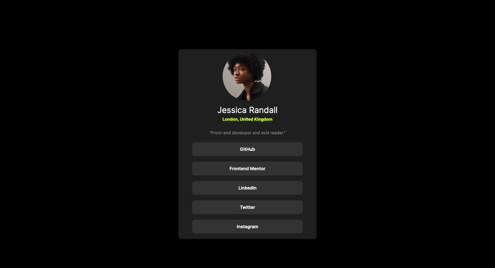

# Frontend Mentor - Social links profile solution

This is a solution to the [Social links profile challenge on Frontend Mentor](https://www.frontendmentor.io/challenges/social-links-profile-UG32l9m6dQ). Frontend Mentor challenges help you improve your coding skills by building realistic projects. 

## Table of contents

  - [The challenge](#the-challenge)
  - [Screenshot](#screenshot)
  - [Links](#links)
- [My process](#my-process)
  - [Built with](#built-with)
  - [What I learned](#what-i-learned)
  - [Continued development](#continued-development)
  - [Useful resources](#useful-resources)
- [Author](#author)

### The challenge

Users should be able to:

- See hover and focus states for all interactive elements on the page

### Screenshot

### Links

- Solution URL: https://www.frontendmentor.io/solutions/social-profile-links-html-css-Zbt2XdDMWQ
- Live Site URL: https://rkennedyy.github.io/Social_Links_Frontend_Challenge/

## My process
Again my process was to first focus on the html elements we would need and then use css, I was happy with for this challenge was the thought process I followed, originally I had put each button into a 
 element to target it with CSS but after reviewing the design and thinking it through I thought a better way to do this was to just target the button element in CSS since they are all the same and saved me having to copy paste the css code and add a bunch of unncessary lines to the css file.

Overall happy with this but feel I need to focus more on responsiveness before I tackle flexbox and bootstrap in the online course im doing.

### Built with

- Semantic HTML5 markup
- CSS custom properties

### What I learned

I think one thing that I was happy with for this challenge was the thought process I followed, originally I had put each button into a 
 element to target it with CSS but after reviewing the design and thinking it through I thought a better way to do this was to just target the button element in CSS since they are all the same and saved me having to copy paste the css code and add a bunch of unncessary lines to the css file.

### Continued development

Again with my previous challenge more focus needs to go on CSS and specifically responsiveness.

## Author

Ross Kennedy
